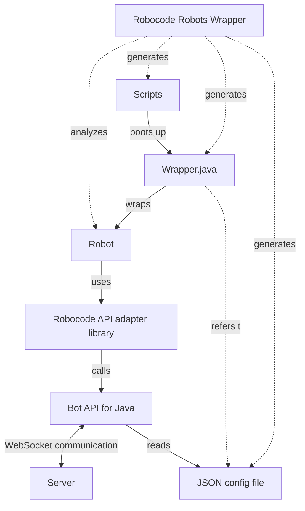

# Robocode API bridge for Tank Royale

This project is provided to make it possible to run original Robocode robots in Robocode Tank Royale by creating a
bridge
between the original [Robocode API] and the [Robocode Tank Royale Bot API].

## Overview

The Robocode API bridge contains:

- [Robocode API adapter library]
    - Provides a library that is compatible with the original Robocode Bot API, but allows Robocode robots to run on the
      Tank Royale platform.
- [Robocode Robots Wrapper]
    - Provides a tool for creating Tank Royale bot directories inside a directory containing robot jar files for the
      original Robocode making it possible to run the robots on Tank Royale.

### Diagram:

#### Robocode Robots Wrapper

The Robocode Robots Wrapper reads in robot jar archives from a directory containing Robocode robots.
Each robot is analyzed (reading the robot´s property file), and the Robots Wrapper generates a JSON config file
containing the bot metadata required by Tank Royale.

The Robot Wrapper also generates scripts and a `Wrapper.java` source file that wraps the Robot, reads the JSON file, and
provides an executable main entry necessary for the generated scripts that will be used for booting the robot using the
Tank Royale Booter. Note that `Wrapper.java` is an executable Java application that can be run directly by the `java`
command without any need of pre-compiling (from Java 11).

#### Robocode API adapter library

The provided adapter library for the Robocode API is 100% identical to the one from the original Robocode, meaning that
the robot will not be able to tell the difference.

The adapter library is calling the Tank Royale Bot API for Java, which takes care of all the communication with the
server via WebSockets.

## 🗒️ Notes

### ❌ No support for the old .Net plugin

Note that only java based Robocode robots are supported. There is no support for .Net-based robots developed for the
now abandoned Net plugin for Robocode. (Note that .Net-based bots are first class citizens in Tank Royale)

### 🌅 Early days

This bridge is still in its very early days, and issues exist that are being worked on continuously. However, it has
been provided in its early state for developers interested in just trying this out, help out testing the bridge and/or
potentially fixing bugs.

Bugs are of course expected to occur primarily in the bridge. But they might as well occur in the Tank Royale Bot API,
at least seen from the perspective of the original Robocode.

### 🎯 Backwards compatibility

Don't expect the bridge to provide a 100% backward compatible robot behaviors. At least not to begin with. That might
be a dream 💖 that is simply not possible or feasible to fulfill, and is not the primary focus of Tank Royale.

Tank Royale was written from scratch with a clean sheet without backwards compatibility as end goal. And the intention
is to keep the design of the new platform as simple and clean as possible. And the rules are really close, but there are
differences.

Hence, we should avoid "polluting" the Tank Royale platform (Bot API and especially the Server) with quirks,
workarounds, built-in Robocode bugs etc. in order to be as backwards compatible as possible with legacy robots. Instead,
it is up to the bridge to fill the gap between the Robocode API and the Tank Royale platform.

That said, bugs in the Bot API and Server causing issues for legacy robots might be fixable without changing anything
for Tank Royale bots, and we might be able to incorporate "orig. Robocode specific" modes in e.g. the Bot API that
allows better backwards compatibility.

### 🤕 Expect issues with legacy robots

Some legacy bots might not be possible (or at least easy) to run via the Robocode bridge for one or the other reason.
E.g. because it uses some internal Java classes (e.g. Sun classes), give classloader problems due to obfuscation, has
timing issues due to network communication, or simply due to bad code or design.

We should take note of those bots, but focus on getting as many (other) robots up and running on this bridge as
possible, and fix the issues with the hard ones at a later point.

[Robocode API]: https://robocode.sourceforge.io/docs/robocode/ "Original Robocode API"

[Robocode Tank Royale Bot API]: https://robocode-dev.github.io/tank-royale/api/java "Robocode Tank Royale Bot API for Java"

[Robocode API adapter library]: /robocode-api "Robocode API adapter library"

[Robocode Robots Wrapper]: /robots-wrapper "Robocode Robots Wrapper"