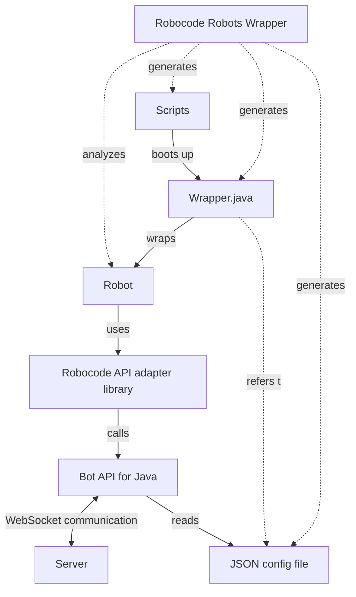

# ARCH-001 — Bridge runtime topology

How an unmodified Robocode robot jar ends up playing a Tank Royale battle.

## The two halves

The repository is two modules that never run at the same time.

**`robots-wrapper` runs before any battle.** It reads a directory of robot jars, inspects each one to find its robot class and metadata, and generates a Tank Royale bot directory beside it: a boot script, a small `Wrapper.java`, and a JSON configuration file describing the bot to the Tank Royale booter. Nothing of the robot is altered — `C-007` — and the wrapper's output is entirely new files.

**`robocode-api` runs inside the battle.** It is the adapter: a library presenting the classic `robocode.*` API to the robot while translating underneath to the Tank Royale Bot API. `ARCH-002` covers why that surface is frozen.

## The process boundaries, and why they matter

A battle spans three kinds of process: the Tank Royale server, the booter that launches bots, and one JVM per bot. Between the robot's `ahead(100)` and the server's view of that movement lie an adapter translation, a Bot API call, and a WebSocket message.

The consequence for this project is diagnostic rather than architectural. A behavioural difference can originate in the adapter's translation, in the Bot API's event queue, in the server's physics, or in the timing of the WebSocket exchange — and the sweep that measures those differences observes only the score at the end. That distance between symptom and cause is the reason `P-001` builds a conformance tier that asserts on what a robot *reports* mid-battle rather than on what it scored at the end.

It is also why a bot process cannot be trusted to die. A robot that hangs holds a JVM that the booter spawned and the server is waiting on, so `ARCH-003`'s isolation model kills process trees rather than processes.

## The load-bearing coupling

The adapter links one Bot API version; the server that hosts the battle is embedded in the runner jar. They speak a versioned protocol, and the pairing is asserted in prose rather than checked. `C-002` carries the rule and the cost of getting it wrong.

This is the joint most likely to break silently, because a mismatch produces idle bots and zero scores — indistinguishable, from the outside, from an adapter that cannot drive its robots.

## What is expensive to change here

The wrapper's generation step. Bot directories are generated ahead of time and then executed by a booter that knows nothing about Robocode, which is what allows unmodified robots to run under an engine that has never heard of them. Replacing generation with a runtime shim would remove a build step and give up that separation — every Tank Royale component downstream of the boot script would need to learn something about legacy robots.

Team support (`CAP-006`) is the first real test of this shape. A team jar is several robots plus a `.team` descriptor, so the wrapper's one-jar-to-one-bot-directory assumption is the thing that has to give.
