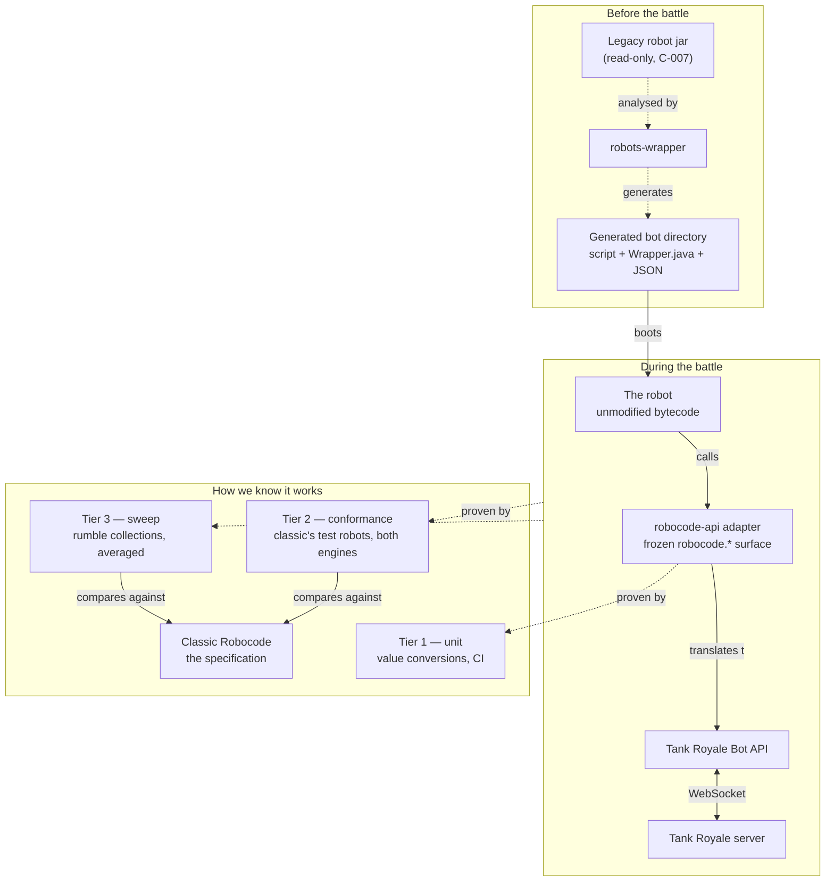

# Architecture

The shape of the whole: structure, actors, module boundaries, technology commitments — the things that are expensive to change.

Architecture documents describe the system, not individual features (feature-level design lives in each capability's `design.md`, navigated from [design/](../design/README.md)). A change updates these documents when it alters the system's structure or public surface; the decision behind such a change is recorded as an ADR in `decisions/`. Documents follow the default lifecycle `draft` → `active`; retiring one means deleting its file and naming its ID in a successor's `supersedes:` field. An agent-extracted document is born `provenance: inferred` with `reversal-cost: low|high` and is promoted to `provenance: verified` by human review.

## Overview

The entry point. The documents indexed below each describe one part in depth; this section is the map that says how they fit and where everything else in the corpus hangs off them.

### What the system is, in one sentence

A compatibility layer that lets a compiled Robocode robot — written years ago against an engine that no longer runs it — play a Tank Royale battle and behave exactly as it did on classic Robocode.

### The whole picture

### The three parts, and which document owns each

| Part | What it is | Owned by |
|---|---|---|
| The wrapper | Turns a robot jar into a bootable Tank Royale bot directory, ahead of any battle | `ARCH-001` |
| The adapter | Presents the classic `robocode.*` API to the robot and translates underneath | `ARCH-001`, with the surface rule in `ARCH-002` |
| The apparatus | Runs both engines and compares them; not shipped, but the reason any claim here is believable | `ARCH-003` |

### The one rule that constrains everything

`ARCH-002`: **no signature in the reproduced `robocode.*` surface may ever change.** Robots were compiled against it and can never be recompiled, so it is a contract with the past rather than a design. Everything behind it — the peers, the mappers, the event translation — is free.

If you read one architecture document before changing this repository, read that one.

### Where the capabilities sit

The corpus splits the goal into promises. They are not arbitrary; each sits at a different point in the picture above.

| Capability | Where in the system |
|---|---|
| `CAP-003` API surface fidelity | Inside the adapter: the value conversions — what happens to a *value* crossing the boundary. |
| `CAP-008` call-routing fidelity | The same boundary, the other axis: what happens to a *call*. Every peer method proven to reach the right Bot API call, with completeness enforced. |
| `CAP-001` event dispatch parity | The path from server to robot: which events arrive, in what order, interruptible where. |
| `CAP-002` physics and state parity | The same path, but about the values the events and status carry. |
| `CAP-004` file I/O sandboxing | Inside the adapter, at the file wrappers. Implemented for the `getDataFile`-reached surface; the raw-`java.io` case is agent-held (`IDR-007`). |
| `CAP-006` team robot support | Inside the wrapper: the one-jar-to-one-bot-directory assumption gave. Wrapper, peer, and team-battle staging are implemented; the wider collection baseline remains part of `M-006`. |
| `CAP-005` score parity | The whole picture, end to end. Detects; does not localise. |
| `CAP-007` the harness | The apparatus itself, which has been wrong in ways mistaken for the bridge being wrong. |

`CAP-003` and `CAP-008` are the two halves of one boundary and are worth holding apart: a value can convert correctly and arrive at the wrong call, which is `AN-005`, and a call can route correctly while the value it carries has the wrong handedness, which is `AN-007`.

The relationship between `CAP-005` and the rest is the other one to hold onto: **the sweep detects, the others localise.** A score gap with no failing conformance test means something is unmodelled, and that is a finding in itself.

### Why the evidence is layered the way it is

`PDR-001` has the reasoning. The short version: a claim about this system can be checked in milliseconds, in minutes, or overnight, and those three are not substitutes.

The layering has already justified itself twice. `AN-005` — gun and radar turn-remaining swapped in a positional constructor call — was found by the fastest tier on its first run, as a one-line diff. `AN-006` — `onDeath` never called — was found by the middle tier on its second robot, and is invisible to the sweep because the battle completes and both robots score.

Both defects had existed for some time in a repository whose only instrument reported percentages.

### The asymmetry worth knowing about

Classic Robocode can be made deterministic through a seed; Tank Royale cannot. `AN-002` records what that costs: exact-value comparison cannot cross the engines, so conformance expectations are written about what a robot *reports* rather than where it ends up, and the sweep is statistical by necessity rather than by choice.

It also has a practical consequence for anyone writing a conformance test: an expectation about an event that needs a particular situation may simply not occur in a short battle, so the tier runs several rounds rather than one.

### What is deliberately not here

Classic Robocode's internals. The bridge reproduces observable behaviour and the API surface, not the implementation, and is free to reach the same behaviour by other means.

The rest of classic's sandbox. `CAP-004` covers file I/O reached through `getDataFile`/`getDataDirectory` because that had an observed defect; a raw `java.io` call that bypasses that surface, along with threads, reflection, and sockets, are real gaps that are scoped out rather than forgotten (`IDR-007`).

## The documents

<!-- clue:index:start -->
- [ARCH-001 — Bridge runtime topology](ARCH-001-bridge-runtime-topology.md) · `active` — The hand-off chain from robot jar to server, and the process boundaries that make a compatibility defect hard to localise.
- [ARCH-002 — The frozen Robocode API surface](ARCH-002-frozen-robocode-api-surface.md) · `active` — Why no signature in `robocode.*` may ever change, and where the implementation behind it is free.
- [ARCH-003 — The two-engine evidence topology](ARCH-003-two-engine-evidence-topology.md) · `active` — Where each test tier runs, which installations it needs, and the isolation model that survives untrusted robots.
<!-- clue:index:end -->
